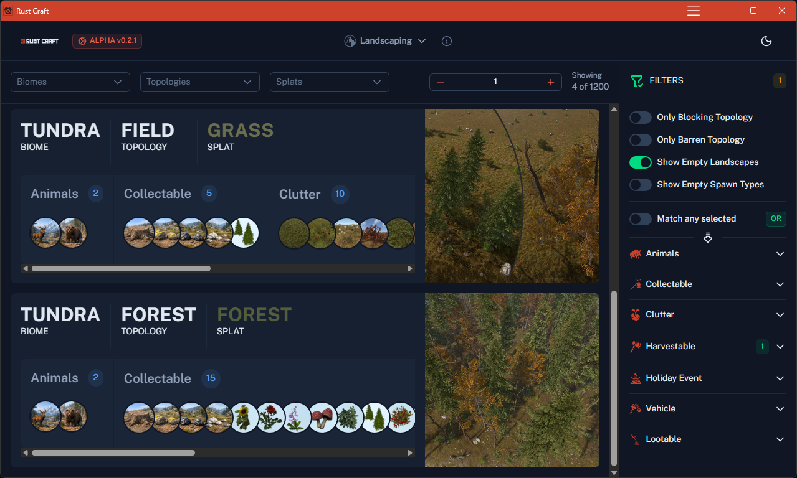
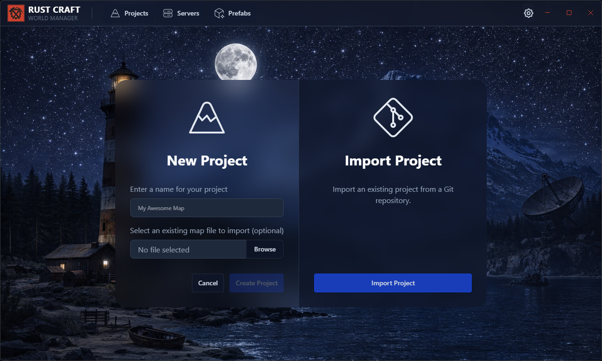

# Rust Craft - Community Portal
Welcome to the repository home of Rust Craft.

## Rust Craft - Topology
https://rust-craft.web.app

A web application consisting of an interactive database to discover and understand the impacts and effects of painting Biomes, Topologies and Splats in your Rust Game custom maps.

**Features:**
- **[Landscaping](https://rust-craft.web.app/landscaping/)** - Understand what Biomes, Topologies and Splat painted layer combinations spawn what world assets such as Loot, Vehicles Animals, Trees, Bushes etc.
- **[Topology Zoning](https://rust-craft.web.app/landscaping/topology-layers)** - Understand what topology layer combinations provide special functionality. 

## Rust Craft - Map Manager (Coming Soon)
A desktop application that helps you manage your custom map projects.

Features:
- **Software Management**
  - Install/maintain tools such as Steam CDM, Rust Dedicated without the faff.

- **Project Management**:
  - Maintain multiple map projects with per-project configurations for Rust Dedicated & Rust Edit.  
  - Easily switch between Rust Public and Staging builds for each project where the Rust Game, Rust Dedicated & Rust Edit tools are all automatically kept in sync with the Games build target.
  - Rust Dedicated Local host launcher and config management.
  - Rust Edit asset management - Organise Prefabs, Brushes, Stamps.
  - Version Control - Backup your maps and assets with ease.

